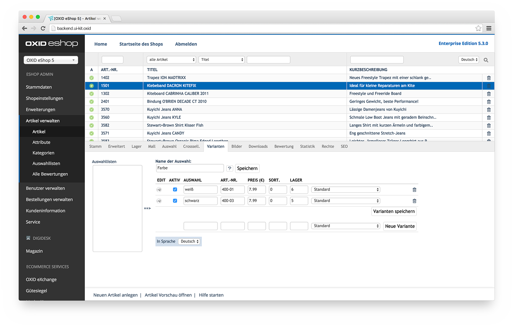

# Backend UI Kit for OXID eShop



## Requirements

* OXID eShop 4.10 (CE, PE) or higher / OXID eShop 5.3 (EE) or higher

## Installation

1. Copy the __modules__ folder into your shop root directory
2. Log into your OXID eShop Admin
3. Navigate to extensions and activate __digidesk - Backend UI Kit__
4. Clear the shop tmp directory

## Build

1. Install Node.js and Grunt
2. Open your terminal/cmd-window and navigate to the package root directory
3. Install the node dependencies: ```npm install```
4. Start the watcher: ```grunt watch```
5. Edit the source files in __build__
6. Resources will automatically be generate in __modules/digidesk/dd_backend_kit/out/src/__

